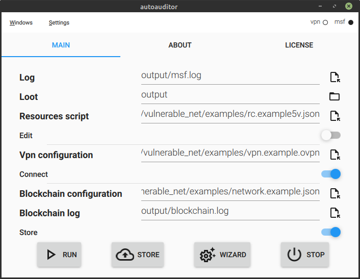
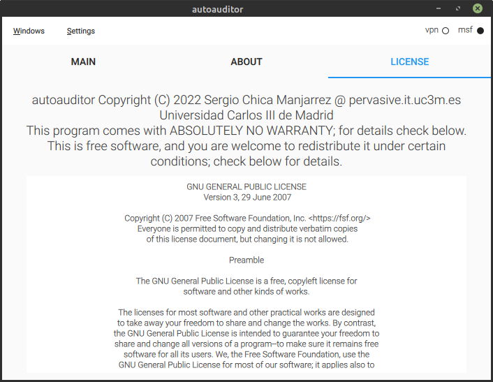

<!-- # WORK IN PROGRESS - TODO: videos -->
# Description
Semiautomatic vulnerabilities auditor using docker containers.
- Resources scripts examples: **tools/vulnerable_net/examples/rc.example\*.json**
- Dockerfiles used in vulnerable network: **third_party/vulhub**
- Vulnerable network docker compose: **tools/vulnerable_net/docker-compose.yaml**
- Fabric network docker compose: **tools/fabric_net/docker-compose\*.yaml**

**Contents:**
  - [Requirements](#requirements)
  - [Pre-execution (optional)](#pre-execution-optional)
    - [Vulnerable network](#vulnerable-network)
    - [Fabric network](#fabric-network)
    - [Groupsig](#groupsig)
    - [Python virtual environment](#python-virtual-environment)
  - [Execution](#execution)
    - [Command line interface](#command-line-interface)
      - [Normal execution](#normal-execution)
      - [Store](#store)
      - [Wizard](#wizard)
      - [Stop](#stop)
      - [Query](#query)
    - [Graphical user interface](#graphical-user-interface)
      - [Normal execution](#normal-execution-1)
      - [Store](#store-1)
      - [Wizard](#wizard-1)
      - [Stop](#stop-1)
  - [Output](#output)
  - [Post-execution (optional)](#post-execution-optional)
    - [Vulnerable network](#vulnerable-network-1)
    - [Fabric network](#fabric-network-1)
    - [Groupsig](#groupsig-1)
    - [Python virtual environment](#python-virtual-environment-1)
  - [Errors and fixes](#errors-and-fixes)
    - [Invalid credentials](#invalid-credentials)
    - [File or directory not found](#file-or-directory-not-found)
    - [DNS resolution failed](#dns-resolution-failed)
  - [Acknowledgements](#acknowledgements)
  - [License](#license)

# Requirements
- docker
- docker-compose-plugin
- git
- go
- python3-dev
- python3-venv

> Tested on Ubuntu 18.04

If groupsig is required:
- build-essential
- cmake
- libssl-dev

# Pre-execution (optional)
## Vulnerable network
We have prepared a containerized environment with vulnerable machines: vulnerable_net

**Features**:
- Isolated network: autoauditor_vulnerable_net
- <details>
    <summary>Ten vulnerable containers + VPN server container</summary>
    <ul>
        <li>autoauditor_vpn_server</li>
        <li>autoauditor_coldfusion_10_2861</li>
        <li>autoauditor_http_14_6271</li>
        <li>autoauditor_struts2_16_3081</li>
        <li>autoauditor_struts2_17_5638</li>
        <li>autoauditor_weblogic_17_10271</li>
        <li>autoauditor_supervisor_17_11610</li>
        <li>autoauditor_goahead_17_17562</li>
        <li>autoauditor_ssh_18_10933</li>
        <li>autoauditor_ssh_18_15473</li>
        <li>autoauditor_rails_19_5418</li>
    </ul>
  </details>
- VPN server to allow external access: autoauditor_vpn_server

**Run**:
```bash
tools/vulnerable_net.sh
```
> **Note:** If groupsig will be used, launch the above command with
> parameter **--with-groupsig** in order to compile the dependencies
```bash
$ tools/vulnerable_net.sh --with-groupsig
```

<!-- > Test environment set up: https://youtu.be/XYmzdHH_G-o -->

## Fabric network
We have prepared a containerized environment mimicking hyperledger
fabric network: fabric_net

**Features**:
- Isolated network: autoauditor_fabric_net
- <details>
    <summary>Twelve containers + DNS container</summary>
    <ul>
        <li>autoauditor_dns</li>
        <li>autoauditor_ca_orderer</li>
        <li>autoauditor_orderer</li>
        <li>autoauditor_ca_org1</li>
        <li>autoauditor_peer0_org1</li>
        <li>autoauditor_couchdb_org1</li>
        <li>autoauditor_ca_org2</li>
        <li>autoauditor_peer0_org2</li>
        <li>autoauditor_couchdb_org2</li>
        <li>autoauditor_ca_org3</li>
        <li>autoauditor_peer0_org3</li>
        <li>autoauditor_couchdb_org3</li>
        <li>autoauditor_cli</li>
    </ul>
  </details>
- Four organizations:
  - Org1: Peer + CA
    - Users: admin, user1, user2
  - Org2: Peer + CA
    - Users: admin, user1, user2
  - Org3: Peer + CA
    - Users: admin, user1, user2
  - Orderer: Orderer + CA
    - Users: admin
- Report smart contract installed in Org1
- Whistleblower smart contract installed in Org1 and Org3
- One DNS resolver.

**Run**:
```bash
$ tools/fabric_net.sh --fill
```

## Groupsig
In order to use groupsig add-on, it is mandatory to compile
the C sources:
```bash
$ cd third_party/libgroupsig/libgroupsig
$ mkdir build
$ cd build
$ cmake ..
$ make
```

And generate the crypto material for each component (must be run
after fabric_net is up):
```bash
$ tools/groupsig.sh
```

Start the provider and verifier servers:
```bash
$ python tools/groupsig/provider/groupsig_provider.py --crt tools/groupsig/provider/provider.crt --key tools/groupsig/provider/provider.key --ca-dir tools/groupsig/provider/fabric_ca_certs
```
```bash
$ python tools/groupsig/verifier/groupsig_verifier.py --crt tools/groupsig/verifier/verifier.crt --key tools/groupsig/verifier/verifier.key -b tools/groupsig/examples/network.example.json
```
Tools to register members in the group, publish disclosures and read disclosures
can be found under `tools/groupsig/informer` and `tools/groupsig/recipient`.

Register:
```bash
$ python tools/groupsig/informer/groupsig_register.py -u tools/groupsig/informer/fabric_credentials --crt user.crt --key user.key -d tools/groupsig/informer/credentials
```
Publish disclosure:
```bash
$ python tools/groupsig/informer/groupsig_inform.py -u tools/groupsig/informer/fabric_credentials --crt user.crt --key user.key -d tools/groupsig/informer/credentials
```
Read disclosures:
```bash
$ python tools/groupsig/recipient/groupsig_read.py -u tools/groupsig/recipient/fabric_credentials --crt user.crt --key user.key
```

## Python virtual environment
In order to enable the virtual environment generated in previous steps, run:

```bash
$ source .venv/bin/activate
```
Or install requirements manually:
```bash
$ pip install -r requirements.txt
```

# Execution
The account that runs autoauditor must be part of **docker** group
in order to access docker API without sudo.
## Command line interface
### List of commands and parameters
```bash
$ python -m autoauditor --help
$ python -m autoauditor.query --help
```

### Normal execution
```bash
$ python -m autoauditor --cli -r tools/vulnerable_net/examples/rc.example5v.json -v tools/vulnerable_net/examples/vpn.example.ovpn -b tools/vulnerable_net/examples/network.example.json
```
- **--cli**: Run autoauditor (command line interface).
- **-r**: Path to the resources script.
- **-v**: Path to the VPN configuration.
- **-b**: Path to the HLF configuration.

<!-- > Run autoauditor (CLI): https://youtu.be/Ogwj8wcaxTI -->

### Store
```bash
$ python -m autoauditor --store -b tools/vulnerable_net/examples/network.example.json
```
- **--store**: Store reports in blockchain without running autoauditor.
- **-b**: Path to the HLF configuration.

<!-- > Reports storage in the blockchain (CLI): https://youtu.be/I9PQNNX6Tdg -->

### Wizard
```bash
$ python -m autoauditor --wizard -r myrc.json
```
- **--wizard**: Run resources script creation tool.
- **-r**: Output path of resources script.

<!-- > Wizard (CLI): https://youtu.be/dCyeBbZZxI8 -->

### Stop
```bash
$ python -m autoauditor --stop
```

<!-- > Stop containers (CLI): https://youtu.be/WXEsy2r9mJ8 -->

### Query
```bash
$ python -m autoauditor.query --query date -qd 2020-12 -b tools/vulnerable_net/examples/network.example.json
```
- **--query**: Type of query. Query by date.
- **-qd**: Filtering date.
- **-b**: Path to the HLF configuration.

<!-- > Search reports (CLI): https://youtu.be/WXEsy2r9mJ8 -->

## Graphical user interface
```bash
$ python -m autoauditor --gui
```
<details>
  <summary>Screenshots</summary>
  <details>
    <summary>Main window</summary>
    <div align="center">
      
    </div>
  </details>
  <details>
    <summary>About</summary>
    <div align="center">
      
    </div>
  </details>
  <details>
    <summary>License</summary>
    <div align="center">
      
    </div>
  </details>
  <details>
    <summary>Menubar</summary>
    <details>
      <summary>Windows menu</summary>
      <div align="center">
        
      </div>
    </details>
    <details>
      <summary>Settings menu</summary>
      <div align="center">
        
      </div>
    </details>
  </details>
  <details>
    <summary>Option information</summary>
    <div align="center">
      
    </div>
  </details>
  <details>
    <summary>Console output</summary>
    <div align="center">
      
    </div>
  </details>
</details>

### Normal execution
<details>
  <summary>Screenshots</summary>
  <details>
    <summary>Executing</summary>
    <div align="center">
      
    </div>
  </details>
</details>

### Store
<details>
  <summary>Screenshots</summary>
  <details>
    <summary>Storing reports</summary>
    <div align="center">
      
    </div>
  </details>
</details>

### Wizard
<details>
  <summary>Screenshots</summary>
    <details>
    <summary>Opening wizard</summary>
    <div align="center">
      
    </div>
  </details>
  <details>
    <summary>Wizard window</summary>
    <div align="center">
      
    </div>
  </details>
  <details>
    <summary>Module information</summary>
    <div align="center">
      
    </div>
  </details>
  <details>
    <summary>Module options</summary>
    <div align="center">
      
    </div>
  </details>
  <details>
    <summary>Module option information</summary>
    <div align="center">
      
    </div>
  </details>
  <details>
    <summary>Module option error</summary>
    <div align="center">
      
    </div>
  </details>
  <details>
    <summary>Payload information</summary>
    <div align="center">
      
    </div>
  </details>
</details>

### Stop
<details>
  <summary>Screenshots</summary>
  <details>
    <summary>Stopping containers</summary>
    <div align="center">
      
    </div>
  </details>
</details>

<!-- > Run of autoauditor (GUI): https://youtu.be/lD7-3q-duTw<br> -->
<!-- > Reports storage (GUI): https://youtu.be/RcQymDZJFYM<br> -->
<!-- > Wizard (GUI): https://youtu.be/nIKc0-E-2bU<br> -->

# Output
- autoauditor log: **output/msf.log**.
- autoauditor loot directory: **output**.
- autoauditor blockchain log: **output/blockchain.log**.
> Output files can be changed with: **-of**, **-od** and **-ob** arguments.

> Stored reports identified by ID(sha256(orgName+reportDate)).

# Post-execution (optional)
## Vulnerable network
Stop vulnerable network
```bash
$ tools/vulnerable_net.sh --down
```

## Fabric network
Stop fabric network
```bash
$ tools/fabric_net.sh --down
```

## Groupsig
Remove crypto material
```bash
$ tools/groupsig.sh --clean
```

## Python virtual environment
Deactivate virtual environment
```bash
$ deactivate
```

# Errors and fixes
## Invalid credentials
> Missing 'proposalResponses' parameter in transaction request.

> status = StatusCode.UNKNOWN<br>
> details = "error validating proposal: access denied: channel [channel1] creator org [Org1MSP]"

**Fix:** Remove wallet-test folder.

## File or directory not found
> FileNotFoundError: [Errno 2] No such file or directory:

**Fix:** Check if fabric network is up. Check paths in network configuration file.

## DNS resolution failed
> status = StatusCode.UNAVAILABLE<br>details = "DNS resolution failed"

**Fix:** Check connection to peers. If using fabric_net, check that
**autoauditor_dns** container is running.

## Failed to connect
> status = StatusCode.UNAVAILABLE<br>details = "failed to connect to all addresses"
**Fix:** Check **grpc_request_endpoint** in network configuration file.

# Acknowledgements
**This work has been supported by National R&D Project TEC2017-84197-C4-1-R and by
the Comunidad de Madrid project CYNAMON P2018/TCS-4566 and co-financed by European
Structural Funds (ESF and FEDER)**

# License
    autoauditor  Copyright (C) 2020-2022 Sergio Chica Manjarrez @ pervasive.it.uc3m.es.
    Universidad Carlos III de Madrid.
    This program comes with ABSOLUTELY NO WARRANTY; for details check below.
    This is free software, and you are welcome to redistribute it
    under certain conditions; check below for details.

[LICENSE](LICENSE)
