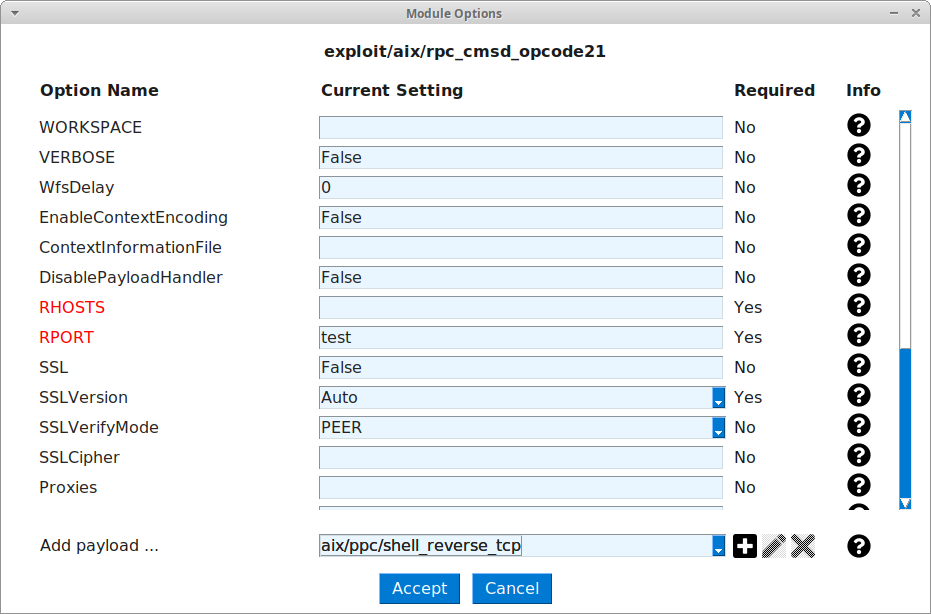

# Descripción
Auto auditor de vulnerabilidades en un entorno dockerizado.
- Los módulos a probar se pueden encontrar en los ficheros **rc.example.\*vuln.json**.
- Los ficheros de configuración de los contenedores están en el directorio **VulMach**.

# Requisitos
La cuenta desde la cual se ejecuta el script debe pertenecer al grupo **docker** de manera
que pueda acceder a la API sin permisos de superusuario.

# Preparación del entorno de pruebas
- Prepara el entorno de pruebas. Este entorno consta de 15 contenedores vulnerables, todos ellos
se encuentran en una subred privada accesible a través de un servidor VPN.

    `cd config && ./setup_test_environment.sh`

> Vídeo de la preparación del entorno de pruebas, subtitulado: https://youtu.be/XYmzdHH_G-o
### Opcional (permite el uso de Hyperledger Fabric)
- Descarga los binarios y los ficheros de prueba para crear la red de HLF.

    `curl -sSL https://bit.ly/2ysbOFE | bash -s -- 2.1.1 1.4.7`

- Copia el script de configuración de la red HLF.

    `cp ../hyperledger/autoauditor_chaincode/chaincode.sh fabric-samples/test-network`

- Copia los ficheros con el chaincode de AutoAuditor.

    `cp -r ../hyperledger/autoauditor_chaincode/ fabric-samples/chaincode`

- Ejecuta el script encargado de instalar el SmartContract en los nodos de HLF. Este scrip levanta todos los componentes
de la red de pruebas de HLF e inicia un contenedor que cumple la función de DNS local para resolver las direcciones
de los nodos.

    `cd fabric-samples/test-network && ./chaincode.sh -u -a -r && cd -`

# Ejecución
- Activa el entorno virtual de Python creado en los pasos anteriores.

    `source autoauditor_venv/bin/activate`

### Ejecución mediante CLI
- Ejecución completa de AutoAuditor.

    `python ../autoauditor/autoauditor.py -r rc.example.5vuln.json -v client.example.ovpn -o output/msf.log -d output/loot -hc network.example.json -ho output/blockchain.log -b`
    - -r: Ejecuta AutoAuditor usando los módulos listados en **rc.example.5vuln.json**.
    - -v: Crea un túnel VPN con la configuración presente en **client.example.ovpn**.
    - -o: (Opcional) Guarda un registro de ejecución en el fichero **output/msf.log**.
    - -d: (Opcional) El botín recolectado de los objetivos se almacenará en el directorio **output/loot**.
    - -hc: Almacena el reporte generado en la blockchain de HLF indicada en el fichero de configuración **network.example.json**.
    - -ho: (Opcional) Guarda una copia de los reportes almacenados en la blockchain en el fichero **output/blockchain.log**.
    - -b: (Opcional) Permite que los contenedores se queden iniciados, no deteniéndolos tras la ejecución de AutoAuditor.

> Vídeo de la ejecución de AutoAuditor mediante CLI: https://youtu.be/Ogwj8wcaxTI
- Ejecución individual de la función wizard de AutoAuditor.

    `python ../autoauditor/autoauditor.py -g rc.myfile.json`

    `python ../autoauditor/wizard.py -g rc.myfile.json`

    - -g: Ejecuta la función de wizard de AutoAuditor, el fichero generado se guardará bajo el nombre **rc.myfile.json**.

> Vídeo del asistente para creación de ficheros de automatización (CLI): https://youtu.be/dCyeBbZZxI8
- Ejecución individual de la función blockchain de AutoAuditor.

    `python ../autoauditor/blockchain.py -o output/msf.log -hc network.example.json -ho output/blockchain.log`
    - -o: Analiza el fichero **output/msf.log** y obtiene los reportes que se almacenarán en la blockchain.
    - -hc: Configuración de la red de HLF presente en el fichero **network.example.json**.
    - -ho: (Opcional) Guarda una copia de los reportes almacenados en la blockchain en el fichero **output/blockchain.log**.

> Vídeo del almacenamiento de reportes en la blockchain (CLI): https://youtu.be/I9PQNNX6Tdg
- Ejecución individual de la función query de AutoAuditor.

    `python ../autoauditor/query.py -q date -t 2020-12 -c network.example.json`
    - -q: Indica el tipo de petición a realizar, en este caso **date**.
    - -t: Indica la fecha **2020-12** como fecha a filtrar en la búsqueda.
    - -c: Configuración de la red de HLF presente en el fichero **network.example.json**.

> Vídeo de la búsqueda de reportes (CLI), subtitulado: https://youtu.be/WXEsy2r9mJ8

### Ejecución mediante GUI
- Ejecución de la interfaz gráfica de AutoAuditor.

    `python ../autoauditor/gui.py`

    

        
 Captura de la ventana de AutoAuditor. 

        

            
        

    

    

        
 Captura de la pestaña Acerca de. 

        

            
        

    

    

        
 Captura de la pestaña Licencia. 

        

            
        

    

    - Cada opción de la interfaz tiene un botón de ayuda en caso de dudas acerca de su funcionamiento.
        

            
 Captura de la ventana de ayuda. 

            

                
            

        

    - Tienes a disposición 4 funciones:
        1. Start: Ejecuta AutoAuditor.
            

                
 Captura de la ventana de AutoAuditor ejecutándose. 

                

                    
                

            

        2. Store: Sube únicamente los reportes a la blockchain de HLF.
        3. Wizard: Inicia el programa de ayuda para la creación de ficheros RC.
           

               
 Capturas de la ventana del wizard. 

               

                   
 Captura de la ventana del wizard. 

                   

                       
                   

               

               

                   
 Captura de la ventana de información del módulo. 

                   

                       
                   

               

               

                   
 Captura de la ventana de opciones del módulo. 

                   

                       
                  

               

               

                   
 Captura de la ventana de error de una opción del módulo. 

                   

                       
                   

               

               

                   
 Captura de la ventana de información de una opción del módulo. 

                   

                       
                   

               

               

                   
 Captura de la ventana de información del payload. 

                   

                       
                   

               

               

                   
 Captura de la ventana de opciones del payload. 

                   

                       
                   

               

               

                   
 Captura de la ventana de información de una opción del payload. 

                   

                       
                   

               

           

        4. Stop: Detiene los contenedores iniciados durante la ejecución de AutoAuditor o el programa de ayuda.
            

                
 Captura de la ventana de AutoAuditor durante la detención de los contenedores. 

                

                    
                

            

> Vídeo de la ejecución de AutoAuditor (GUI): https://youtu.be/lD7-3q-duTw 
> Vídeo del almacenamiento de reportes en la blockchain (GUI): https://youtu.be/RcQymDZJFYM 
> Vídeo del asistente para creación de ficheros de automatización (GUI): https://youtu.be/nIKc0-E-2bU 

# Salida
- Se conservará una copia del registro de ejecución de metasploit framework (community), separado por módulos, en el fichero **output/msf.log**.
- Se almacenará el botín recolectado durante la ejecución en el directorio **output/loot**.
- Se almacenarán los reportes generados en la blockchain indicada por **network.example.json** con identificador sha256(orgName+reportDate).
- Se creará una copia de los reportes almacenados en la blockchain en **output/blockchain.log**.

# Limpieza del entorno
- Desactiva el entorno virtual de Python

    `deactivate`
- Ejecuta el script de preparación del entorno de pruebas. Detiene todos los contenedores, además, se elimina
cualquier archivo temporal usado.

    `./setup_test_environment.sh -s`

- (Opcional) Ejecuta el script de la red de HLF. El script eliminará la red de HLF y detendrá el contenedor iniciado para el DNS local.

    `cd fabric-samples/test-network && ./chaincode.sh -d && cd -`

# Entornos virtuales
La ejecución se realiza en un entorno virtual, sin embargo, es necesario que la cuenta de usuario desde
la que se ejecuta la herramienta pertenezca al grupo **docker** para que se pueda comunicar
con la API.

# Posibles problemas, causas y soluciones
> Missing 'proposalResponses' parameter in transaction request.

> status = StatusCode.UNKNOWN 
> details = "error validating proposal: access denied: channel [mychannel] creator org [Org1MSP]"

- Errores que se obtienen al usar credenciales inválidas tras realizar alguna petición contra la blockchain.

**Solución:** Borrar la carpeta wallet-test del directorio de trabajo.

 

> FileNotFoundError: [Errno 2] No such file or directory:

- Error obtenido al ejecutar AutoAuditor.

**Solución:** Comprueba que la blockchain esté correctamente instanciada. Si es así, comprueba que las rutas en el fichero
de configuración de la blockchain son correctas.

 

> status = StatusCode.UNAVAILABLE details = "DNS resolution failed"

- Error al realizar cualquier petición contra la blockchain.

**Solución:** Comprueba que tienes conexión a los nodos de la red HLF. Si estás usando el entorno de pruebas,
comprueba que el contenedor docker-resolver está ejecutándose.
